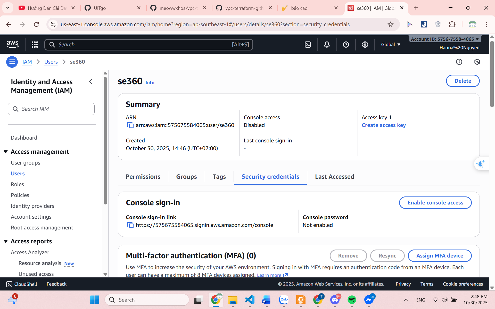

# README.md

## Table of Contents:

* [Introduction](#introduction)
* [Setup Instruction](#setup-instructions)
    * [Create user IAM](#create-user-iam)
    * [Run Terraform](#run-terraform)

## Introduction
This repository contains the Infrastructure as Code (IaC) for UITGO, using Terraform to automate the deployment of AWS resources.

## Setup Instructions:
1. **Create user IAM**
- Go to IAM section in AWS Management Console

- In the left panel, select Users

- Click Create user, then enter a username of your choice

- Choose attach the necessary policies. Under Permissions policies, choose AdministratorAccess in order to allow Terraform full access to manage resources

- Once the user is created, it will appear in the users list

- Click on that user and go to ``Security Credentials`` tab

- Scroll down to ``Access keys``, then click ``Create access key``

- In use case section, select ``CLI``, check the box for ``I understand the above recommendation and want to proceed to create an access key.``

- After creating access keys, we can either download the CSV file to save the keys or copy them directly (secret access key is only shown once)


2. **Run Terraform**
- Clone the repo
```bash
https://github.com/UITgo/IaC.git
cd UITGO
```

- In terminal, cd UITGO, and configure your aws
```bash
aws configure
```


- Initialize Terraform
```bash
terraform init
```

- Ensures your configuration syntax and structure are correct
```bash
terraform validate
```

- Preview the Deployment. This shows all resources that Terraform will create, modify, or destroy

```bash
terraform plan
```

- Apply the Configuration
```bash
terraform apply
```